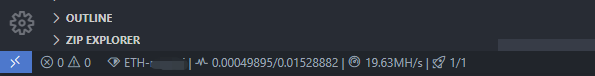
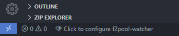

# f2pool-watcher

This is a VS Code extension that can show [F2Pool](https://www.f2pool.com/) mining informations in the status bar.

## Features

1. Displays value, hashrate and worker information of a specified F2Pool currency and username.
2. Supports automatic refresh at a specified interval

## Usage

1. After installing the plugin, click it to set currency and F2Pool username, if the username is valid, corresponding F2Pool info should show in the status bar.
2. Click the plugin to manually refresh.
3. Hover on the plugin to show a tooltip of details.

## Extension Settings

This extension contributes the following settings:

* `f2poolWatcher.currency`: set the currency, currently supports "BTC", "LTC", "ETH"
* `f2poolWatcher.username`: set the F2Pool username
* `f2poolWatcher.refreshInterval`: set the automatic refresh interval in minutes, set to 0 to disable auto-refresh, or it must be equal or greater than 5.

## Release Notes

### 1.0.0

Initial release of f2pool-watch
